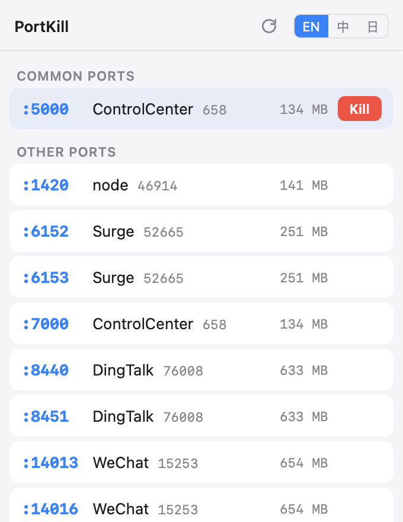

<div align="center">


# PortKill

**リッスン中のポートを一覧表示。占有プロセスをワンクリックで終了。**

`lsof -i :3000` → `kill -9` はもう不要。メニューバーに常駐します。

[](https://github.com/BoBo-C/portkill)
[](https://tauri.app)
[](https://vuejs.org)
[](LICENSE)

[English](README.md) · [简体中文](README.zh-CN.md) · 日本語



</div>

## なぜ作ったか

フロントエンド開発者なら誰もが経験する `Error: port 3000 is already in use`。`lsof` のコマンドを検索して `kill -9`……。PortKill はその一連の作業をメニューバーのワンクリックに変えます。

## 機能

- ⚡ **ワンクリック Kill** — リッスン中の全 TCP ポートをプロセス名・PID・メモリ使用量付きで一覧表示。ホバーして Kill を押すだけ
- 📌 **開発用ポートを常に上位に** — 3000、5173、8080 などを自動的にピン留め
- 🎯 **アプリを前面に表示** — 行を右クリックすると、そのプロセスを所有するアプリをアクティブ化(親プロセスを遡るため、VS Code のターミナルで起動した `node` なら VS Code が前面に)
- 🖥 **本格的なメニューバーアプリ** — 非アクティブ化パネル。どの操作スペースでも、フルスクリーンアプリの上でも表示され、メニューバーを隠さず、フォーカスを失うと自動で閉じる
- 🌗 ダークモードはシステムに追従 · UI は English / 中文 / 日本語 対応

## インストール

[Releases](https://github.com/BoBo-C/portkill/releases) から最新の `.dmg` をダウンロードし、アプリケーションフォルダへドラッグ。

公証(notarization)は未対応のため、macOS が起動を拒否する場合:

```sh
xattr -cr /Applications/PortKill.app
```

## 使い方

メニューバーの ⚡ アイコンをクリック。パネルを開くたびに一覧が更新されます(更新ボタンも有り)。

| 操作 | 結果 |
| --- | --- |
| **終了** をクリック | プロセスに SIGKILL を送り、一覧を更新 |
| 行を右クリック | **アプリを前面に表示** — 所有アプリをアクティブ化 |
| 行にホバー | ツールチップに完全なプロセス名・PID・バインドアドレスを表示 |

> root(または他ユーザー)のプロセスは権限がないため終了できません。PortKill は黙って失敗せず、その旨を表示します。

## 仕組み

- ポート一覧:Rust 側で `lsof -nP -iTCP -sTCP:LISTEN -F pcn` を解析。IPv4/IPv6 の重複は除去
- メモリ:更新ごとに `ps -o pid=,rss=` を 1 回だけ実行してまとめて取得
- Kill:まず `SIGTERM` でクリーンアップの猶予を与え、500ms 以内に終了しない場合のみ `SIGKILL` へ。シグナル送信直前に pid/ポートを再検証(PID 再利用対策)
- フルスクリーン対応:[tauri-nspanel](https://github.com/ahkohd/tauri-nspanel) でウィンドウを非アクティブ化 `NSPanel` に変換(`CanJoinAllSpaces` + `FullScreenAuxiliary`)

## ソースからビルド

必要環境:Node 18+、Rust 1.80+、Xcode Command Line Tools。

```sh
git clone https://github.com/BoBo-C/portkill.git
cd portkill
npm install
npm run tauri dev     # 開発
npm run tauri build   # 成果物は src-tauri/target/release/bundle/(.app + .dmg)
```

```
src/                    Vue フロントエンド(App.vue、i18n.js、styles.css)
src-tauri/src/lib.rs    トレイアイコン、パネル開閉、コマンド登録
src-tauri/src/ports.rs  lsof / ps の解析、kill
src-tauri/src/macos_panel.rs  NSPanel 変換、位置調整、アプリの前面表示
```

## ライセンス

[MIT](LICENSE)
